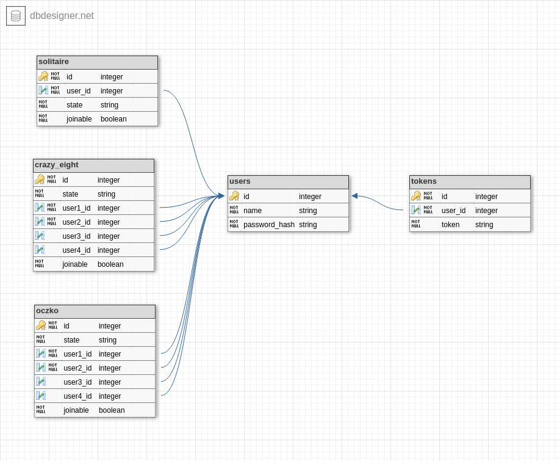

# Kokinejo

Kokinejo to platforma z grami, dzieki której można grać wraz z innymi użytkownikami.

## Identyfikacja zagadnienia biznesowego

W dziesiejszych czasach praktycznie każdy nastolatek spędza czas wolny grając. Dodatkowo pandemia sprawiła, że nie można już sie widywać "na żywo" co sprawia że wszelkiego rodzaju czynności, które można wykonywac online wraz z innymi zyskują na popularności.

Nasza aplikacja ma na celu zapewnić dostęp do gier wieloosobowych, dzięki którym będzie można łatwo i przyjemnie spędzić czas ze znajomymi na odległość. Dodatkowo dostępne gry będą dobrze znanymi grami, w które chętnie zagra osoba także nie poświęcająca tego rodzaju hobby wiele czasu.


(źródło: bankier.pl)


(źródło: [similarweb.com](https://www.similarweb.com/website/kurnik.pl/))

### CELE

1. Stworzenie platformy umożliwiającej spedzanie czasu ze znajomymi lub osobami tam poznanymi.
2. Implementacja kilku podstawowych, znanych gier wieloosobowych.

## Wymagania systemowe i funkcjonalne

Serwer napisany będzie z użyciem Node.js i frameworku Express.
Nasza aplikacja będzie realizowana w sposób modułowy. Główna część serwera będzie odpowiadać za wyświetlenie strony początkowej, załadowanie kodu klienta oraz za autentykację użytkowników, a następnie żądania będą przekazywane do osobnych modułów - konkretnych gier.
Taki podział ułatwi tworzenie aplikacji oraz jej przyszłą rozbudowę.
Pozowoli on też na realizację różnych gier niezależnie od siebie.

Klient zostanie utworzony jako tzw. Single Page Application - z wykorzystaniem HTMLa i CSSa, a reakcję na działania użytkownika zapewniać będzie framework Vue.js.
Taki wybór, wraz z dostępnymi narzędziami, pozwoli podzielić funkcjonalność klienta na konkretne moduły - odpowiadające grom.
Dzięki temu kod będzie ładował się szybciej, a sama aplikacja będzie działać wydajniej, co wpłynie pozytywnie na postrzeganie aplikacji przez końcowych użytkowników.
Ze względu na rodzaj aplikacji - dynamiczne gry - nie planujemy wspierać przeglądarek, które nie obsługują JavaScriptu. Ze względu na ograniczony czas realizacji projektu, aplikacja nie będzie też wspierać przeglądarek innych niż Google Chrome i Firefox oraz ich starszych wersji.
Komunikacja pomiędzy klientami i serwerem będzie odbywać się w stylu REST, co jest wystarczające w przypadku prostych gier planszowych.

Stan konkretnych gier oraz informacje o użytkownikach przechowywane będą w bazie SQLite.
Serwer będzie obciążony głównie weryfikacją reguł gry, baza ta nie będzie stanowiła więc ograniczenia dla jednowątkowego serwera Node.js.
Pozwoli to także łatwo przełączyć serwer na osobną bazę SQL, w przypadku konieczności przyszłego skalowania poziomego aplikacji.

--------------------

## Harmonogram prac i zespół projektowy

1. Stworzenie dokumentacji projektu na potrzeby implementacji

    Zadanie | Czas realizacji | Osoba odpowiedzialna
    --------|---------------- | --
    spisanie i opisanie pełnej funkcjonalności projektu        | 2h | spotkanie (23.05)

    _Data_: 30.05.21

    _Efekt końcowy_: Będzie stworzona pełna dokumentacja projektu, okreslająca dokładnie funkcjonalność jaką należy zaimplementować i w jaki sposób ma działać.

2. Stworzenie backendu aplikacji

    Zadanie | Czas realizacji | Osoba odpowiedzialna
    --------|----------------| ---
    szkielet backendu (utworzenie projektu, połączenie z bazą) | 5h | Wojciech
    autentykacja użytkowników                                  | 4h | Jarosław
    stworzenie testowego modułu (kółko i krzyżyk)              | 4h | Wojciech

    _Data_: 07.06.21

    _Efekt końcowy_: Będzie utworzony szkielet aplikacji backendowej, do którego będą w przyszłości dołączane kolejne moduły z grami.

3. Stworzenie frontendu aplikacji zawierającego podstawową funkcjonalność (bez gier)

    Zadanie | Czas realizacji | Osoba odpowiedzialna
    --------|----------------| ---
    szkielet frontendu (utworzenie projektu, połączenie z backendem) | 5h | Aleksandra
    utworzenie ekranów logowania/rejestracji                         | 2h | Jarosław
    stworzenie testowego modułu (kółko i krzyżyk)                    | 4h | Aleksandra
    interfejs dla gier karcianych                                    | 3h | Jarosław

    _Data_: 07.06.21

    _Efekt końcowy_: Będzie utworzony szkielet aplikacji frontendowej, ekran rejestracji/logowania. Szkielet będzie rozszerzany o kolejne moduły z grami.

4. Dodanie gier do istniejącej części aplikacji

    Zadanie | Czas realizacji | Osoba odpowiedzialna
    --------|-----------------|---
    gra "crazy eight"       | 30h | Wojciech
    gra "oczko"             | 30h | Jarosław
    gra pasjans "Solitaire" | 25h | Aleksandra
    ... | ...h

    _Data_: 29.06.21

    _Efekt końcowy_: Można grać w gry

## Analiza zagadnienia i jego modelowanie

### Schemat bazy danych



### Przepływ danych

Przepływ danych opiera się o komunikację REST.
Każda gra będzie miała swój prefix w url, np. `/oczko`

#### POST `/login`

Żądanie

```json
{
    "name": "nazwa",
    "password": "hasło"
}
```

Odpowiedź

```json
{
    "status": "ok",
    "token": "token"
}
```

#### POST `/signup`

Żądanie

```json
{
    "name": "nazwa",
    "password": "hasło"
}
```

Odpowiedź

```json
{
    "status": "ok",
    "token": "token"
}
```

#### GET `/logout`

Odpowiedź

```json
{
    "status": "ok"
}
```

Endpointy dla gier

#### GET `/<prefix>/available_games`

Odpowiedź

```json
{
    "status": "ok",
    "games_ids": [
        1, 2, ...
    ]
}
```

#### GET `/<prefix>/:id/join`

Odpowiedź

```json
{
    "status": "ok",
    "game_state": {
        // stan gry
    }
}
```

#### GET `/<prefix>/:id/leave`

Odpowiedź

```json
{
    "status": "ok"
}
```

#### GET `/<prefix>/:id/ready`

Odpowiedź

```json
{
    "status": "ok"
}
```

#### GET `/<prefix>/:id/state`

Odpowiedź

```json
{
    "status": "ok",
    "game_state": {
        // stan gry
    }
}
```

#### POST `/<prefix>/:id/make_move`

Żądanie

```json
{
    "move": {
        // zależne od gry
    }
}
```

Odpowiedź

```json
{
    "status": "ok",
    "game_state": {
        // stan gry
    }
}
```

## Implementacja i testowanie

Do dnia 07.06 (najpóźniej) przygotowanie  wstępnych  elementów implementacjii umieszczenie ich w repozytorium GitHub.

## Podsumowanie

Do dnia 30.06 zakończenie prac nad aplikacją i prezentacja.
